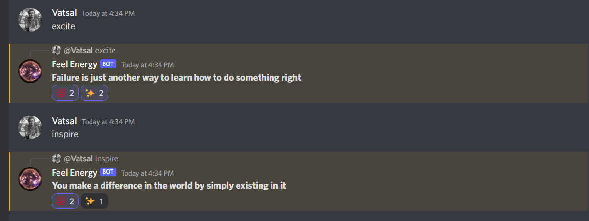
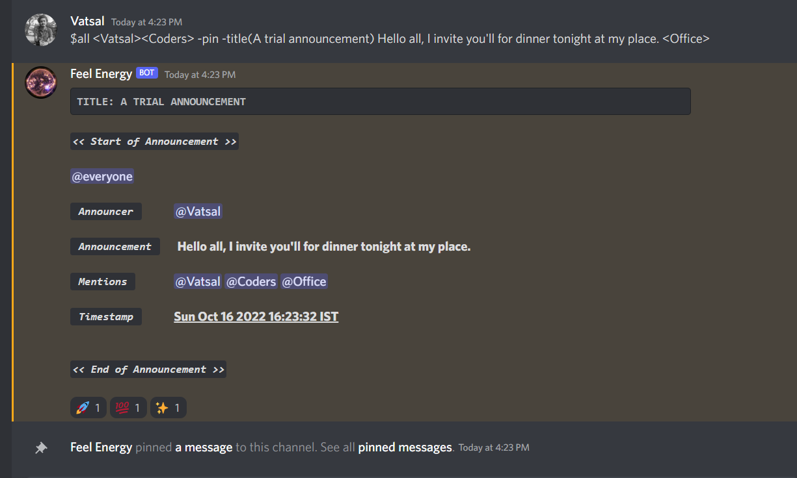
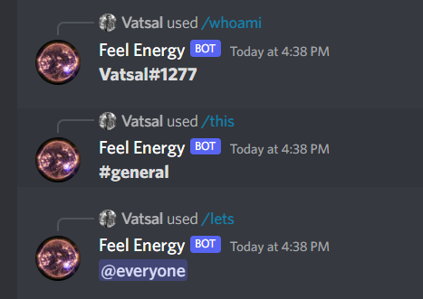

<div align="center">
  
  
 # Feel Energy

  <p>
    <strong>Discord Bot</strong><br>
    <a href="https://discord.com/api/oauth2/authorize?client_id=1030484788001374279&permissions=534992383040&scope=bot">Add to Server</a>

  </p>
</div>


## Features

### Get Affirmations

```sh
excite
```

```sh
inspire
```

Get exciting affirmations to blow your grinding power.
 
<br>

#### Note: No other text excluding required command should be added.

<br>

### Announcement Creation

```sh
$all -pin -title(...) ..... <...> <...>
```
The &ensp;`$all`&ensp; is used to grab everyone's attention.

The &ensp;`-pin`&ensp; flag pins the announcement if the announcer has one of the &ensp;`boss`&ensp; `head`&ensp; `captain`&ensp; `leader`&ensp; `owner`&ensp; `admin`&ensp; `manager`&ensp; roles. If not mentioned, the annoucement won't be pinned.

The &ensp;`-title`&ensp; flag marks the text as &ensp;`Title`&ensp; for the annoucement which would appear as heading. If not mentioned, the &ensp;`Title`&ensp; will be empty.

The text in the announcement section is the main content to be displayed as notice. If not mentioned, the &ensp;`Annoucement`&ensp; will be empty.

The referencing section can be used for mentioning different users and role members from the server, in the announcement by adding their username or role in angular brackets('<' & '>'). If not mentioned, then no user or role members will be tagged.

#### Note: The order of the flags and sections doesn't matter.

<br>

<br>

### Slash Commands

```sh
/whoami
```

```sh
/lets
```

```sh
/this
```

<br>

<br>

### [Add Feel Energy Bot to Discord Server](https://discord.com/api/oauth2/authorize?client_id=1030484788001374279&permissions=534992383040&scope=bot)
